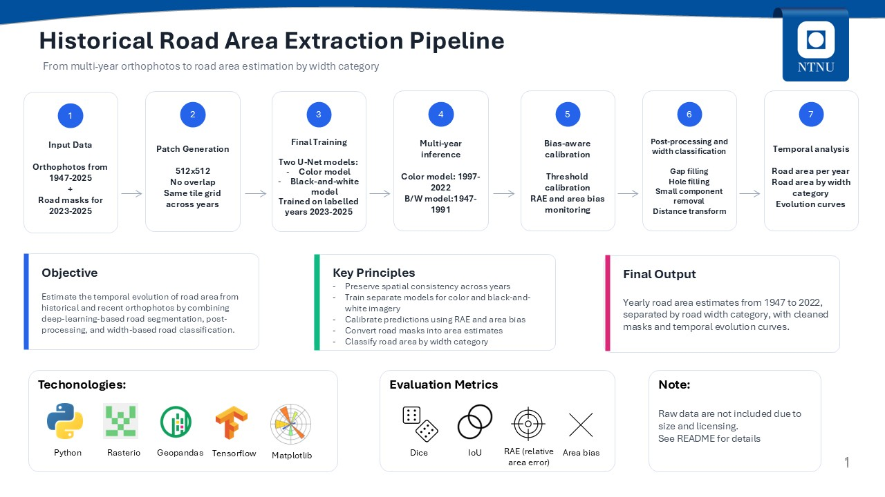
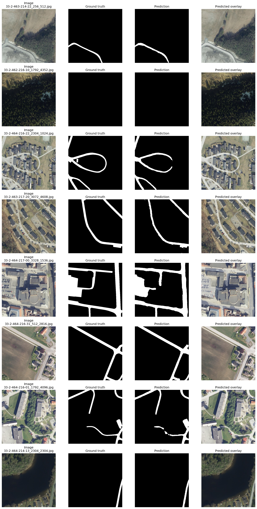

# Master Thesis – Leo Liberkowski

## Historical road area extraction from Norwegian orthophotos

This repository contains the code developed for my master thesis on road extraction from Norwegian orthophotos. The project combines geospatial preprocessing, deep learning segmentation, multi-year inference, post-processing, road-width classification, and temporal analysis of road area.

The main objective is not only to segment roads visually, but also to estimate how the **total road area** evolves through time from historical and recent orthophotos.

---

## Project overview

The workflow is organized into six main steps:

1. **Data preparation**  
   Orthophotos and road vector data are converted into aligned image and mask patches.

2. **Model training**  
   U-Net models are trained for road segmentation. Two final models are used:
   - a color model for recent RGB orthophotos;
   - a black-and-white model for historical grayscale orthophotos.

3. **Multi-year inference**  
   The trained models are applied to unlabelled years.

4. **Visual validation and bias checking**  
   Predictions are inspected visually and area bias is evaluated when reference masks are available.

5. **Post-processing and width classification**  
   Predicted masks are cleaned, road gaps are filled, road width is estimated, and road pixels are classified into width categories.

6. **Temporal analysis**  
   Road area is aggregated by year and by road-width category to study long-term changes.

---

## Repository structure

```text
master_thesis/
├── configs/
│   └── train_config.yaml
├── docs/
│   └── pipeline_overview.JPG
├── examples/
│   └── <YEAR XXXX>
│      ├── images
│      └── masks
├── notebooks/
│   └── demo_predictions.ipynb
├── results/
│   ├── prediction_examples.png
│   └── training_loss.png
├── src/
│   └── road_segmentation/
│       ├── mask_generation.py
│       ├── patch_generation.py
│       ├── preprocessing.py
│       ├── dataset.py
│       ├── train.py
│       ├── training_final.py
│       ├── inference_all_years.py
│       ├── postprocess_width_area.py
│       ├── losses.py
│       ├── unet.py
│       └── visualization.py
├── requirements.txt
├── pyproject.toml
└── README.md
```

Some files listed above, such as `training_final.py`, `inference_all_years.py`, and `postprocess_width_area.py`, correspond to the final pipeline and should be added to `src/road_segmentation/` if they are not already present.

---

## Data structure

The raw data and generated datasets are not included in this repository because of file size and licensing constraints.

The code expects a local data structure similar to:

```text
data/
├── 01.raw/
│   ├── mask/
│   └── orthophoto/
├── 03.pre_ML/
│   └── data_512_no_stride/
│       ├── 1947/
│       │   └── images/
│       ├── 1957/
│       │   └── images/
│       ├── ...
│       ├── 2023/
│       │   ├── images/
│       │   ├── images_b_and_w/
│       │   └── masks/
│       ├── 2024/
│       │   ├── images/
│       │   ├── images_b_and_w/
│       │   └── masks/
│       └── 2025/
│           ├── images/
│           ├── images_b_and_w/
│           └── masks/
├── 04.training/
└── 05.predictions/
```

The labelled years used for final model training are:

```text
2023, 2024, 2025
```

The final inference years are split into two groups:

```python
OLD_YEARS = [1947, 1957, 1964, 1977, 1991]

RECENT_YEARS = [
    1997, 2006, 2009, 2010, 2011,
    2014, 2015, 2016, 2017, 2019,
    2020, 2021, 2022,
]
```

---

## Methodology

### 1. Mask generation

Vector road geometries are rasterized into binary road masks aligned with orthophoto tiles. The road geometries are handled in the projected coordinate system used by the Norwegian data, typically EPSG:25833.

### 2. Patch generation

Orthophotos and masks are cut into aligned 512 × 512 patches. The final dataset uses non-overlapping patches to avoid redundancy.

### 3. Final model training

Two final U-Net models are trained:

| Model | Input images | Intended use |
|---|---|---|
| Color model | RGB orthophotos | Recent color years |
| Black-and-white model | Grayscale images converted to 3-channel input | Historical grayscale years |

The final training uses all labelled years:

```text
train = 2023 + 2024 + 2025
```

Earlier validation experiments are used to select hyperparameters, calibrated thresholds, and the number of epochs. The final training does not use a validation split, because all labelled data is used to fit the final models.

### 4. Area-oriented evaluation

In addition to common segmentation metrics, the project focuses on road-area estimation.

Main segmentation metrics:

- Dice coefficient
- Intersection over Union, IoU
- Precision
- Recall

Area-oriented metrics:

```text
area_bias = (predicted road pixels - true road pixels) / true road pixels
RAE       = abs(predicted road pixels - true road pixels) / true road pixels
```

The calibrated threshold is selected to minimize Relative Area Error on validation data.

### 5. Inference

The final inference applies:

```text
recent RGB years        -> color model
historical grayscale years -> black-and-white model
```

Predicted masks are saved as binary PNG files.

Example output structure:

```text
data/05.predictions/final_model_test1/
├── 1947/
│   └── masks_pred/
├── 1957/
│   └── masks_pred/
├── ...
└── 2022/
    └── masks_pred/
```

### 6. Post-processing and width classification

The post-processing step takes predicted mask patches as input and produces yearly road-area estimates by width category.

Per patch:

1. Load predicted road mask.
2. Close small gaps using morphological closing.
3. Fill small holes inside predicted roads.
4. Remove small isolated components.
5. Compute a distance transform.
6. Estimate road width using the road skeleton and distance map.
7. Classify road components by width.
8. Accumulate areas per year and category.

Width categories:

| Class | Width category |
|---|---|
| 1 | 0–4 m |
| 2 | 4–6 m |
| 3 | 6–8 m |
| 4 | >8 m |

Main outputs:

```text
area_by_year.json
area_evolution_by_width.png
area_evolution_total.png
postprocessing_year_stats.csv
postprocessing_patch_stats.csv
postprocessing_component_stats.csv
```

---

## Pipeline overview



---

## Installation

Create and activate a Python environment:

```bash
conda create -n roads python=3.10
conda activate roads
```

Install dependencies:

```bash
pip install -r requirements.txt
```

For GPU training, TensorFlow should be installed according to the CUDA and driver versions available on the machine.

---

## Usage

### Data preparation

Generate masks and patches:

```bash
python -m src.road_segmentation.mask_generation
python -m src.road_segmentation.patch_generation
```

### Final training

Train the final color and black-and-white models on all labelled years:

```bash
python -m src.road_segmentation.training_final
```

Expected outputs:

```text
data/04.training/trondheim_training/final_models_2023_2024_2025_test1/
├── color/
│   ├── models/
│   ├── channel_stats.json
│   └── final_threshold.json
└── black_and_white/
    ├── models/
    ├── channel_stats.json
    └── final_threshold.json
```

### Multi-year inference

Run inference on historical and recent years:

```bash
python -m src.road_segmentation.inference_all_years
```

Expected outputs:

```text
data/05.predictions/final_model_test1/<YEAR>/masks_pred/
```

### Post-processing and temporal area analysis

Run post-processing and classify road area by width:

```bash
python -m src.road_segmentation.postprocess_width_area
```

Expected outputs:

```text
data/05.predictions/final_model_test1/area_by_year.json
data/05.predictions/final_model_test1/area_evolution_by_width.png
data/05.predictions/final_model_test1/area_evolution_total.png
```

---

## Example predictions



---

## Notes on reproducibility

Large files are intentionally excluded from Git tracking:

- raw orthophotos;
- generated masks and image patches;
- trained models;
- prediction outputs;
- intermediate NumPy arrays and CSV summaries.

The repository is intended to contain the source code, configuration files, documentation, and small examples only.

---

## Author

Leo Liberkowski  
Master thesis project on historical road extraction and road-area evolution from Norwegian orthophotos.
